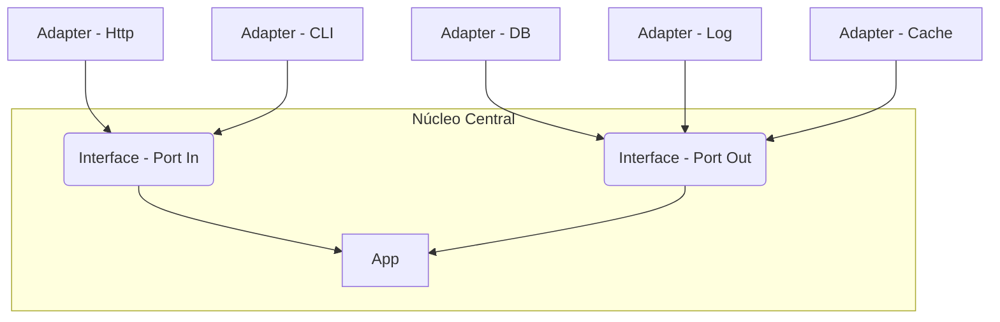

# POC (Proof of Concept) - Arquitetura Hexagonal (Ports and Adapters)

  

## O que é o Arquitetura hexagonal? :writing_hand:

  

De maneira simplista é uma maneira de escrever um software que busca separar as preocupações e promover a modularidade em um sistema. Na sua configuração básica, a arquitetura é composta por um núcleo central, representando a lógica de negócios, cercado por portas que definem as interfaces de entrada e saída. Essas portas são conectadas a adaptadores, que são responsáveis por traduzir as operações do núcleo para o formato esperado pelos componentes externos, como interfaces de usuário, bancos de dados ou serviços externos.

## Visualização da Arquitetura :framed_picture:


## Benefícios e Malefícios :thinking:
- ### Beneficio
Essa abordagem facilita a testabilidade, manutenção e evolução do software, uma vez que as dependências externas são isoladas, permitindo a substituição fácil de componentes sem afetar o núcleo da aplicação, com isso a aplicação *se paga* ao longo do tempo.
- ### Malefícios
Complexidade no geral, principalmente em inicio de projeto pode exigir mais esforço e planejamento do que abordagens mais simples, além de, quando seguido as a **risca** as boas práticas, pode levar a certa quantidade de overhead.
	
## Conceitos vinculados :nerd_face:
Existem vários conceitos que podemos vincular a arquitetura hexagonal, porém o que **eu** bato o olho e vejo claramente "necessário" é a aplicação de [DDD](https://fullcycle.com.br/domain-driven-design/) e [SOLID](https://medium.com/backticks-tildes/the-s-o-l-i-d-principles-in-pictures-b34ce2f1e898). Onde o conceito principal do DDD, a forma de desenvolvimento do software voltado ao core da aplicação, se enquadra perfeitamente e referente ao SOLID destacamos o **D**, Dependency Inversion Principle, onde modulos de baixo nivel não devem depender dos modulos de alto nivel e sempre trabalhar com abstrações (Interfaces).

## Propósito e resumo da POC :mage:

A priori este repositório tem o intuito de servir como demonstração prática dos princípios da arquitetura hexagonal utilizando a linguagem [Go](https://go.dev/).
O core da aplicação é simples, um sistema para criar, consultar,  habilitar e desabilitar um produto, com 3 adaptadores, **web** (usando http com o auxilio da lib [Gorilla mux](https://github.com/gorilla/mux)), **CLI** (com o auxilio da lib [Cobra](https://github.com/spf13/cobra)) e **DB** usando SQL.

- Para executar via **CLI**:
```bash
go run main.go cli --help
```
Apresentará as flags:
```
Flags:
  -a, --action string    Enable / Disable a product (default "enable")
  -h, --help             help for cli
  -i, --id string        ProductId
  -p, --price float      Product name
  -n, --product string   Product name
```
- via **http** (porta 9000) :
```bash
go run main.go http
```
Subirá o servidor e fornecerá a mensagem
`` Webserver has been started ``

## Links úteis :globe_with_meridians:
- ### [Medium - Arquitetura Hexagonal](https://medium.com/ssense-tech/hexagonal-architecture-there-are-always-two-sides-to-every-story-bc0780ed7d9c)
- ### [Dr. Alistair Cockburn - Arquitetura Hexagonal](https://alistair.cockburn.us/hexagonal-architecture/)
	
## 
<p align="center">
  
  
</p>
